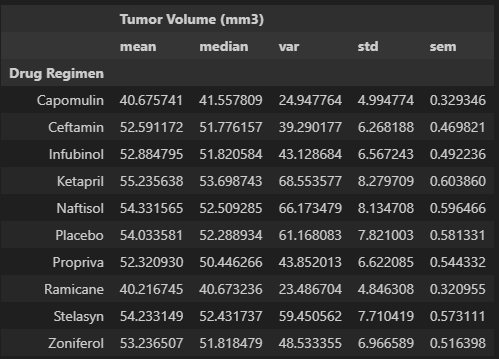

# Pymaceuticals Inc.

## Purpose

The purpose of this study was to compare the performance of Pymaceuticals drug of interest, Capomulin, against the other treatment regimens.

## Tasks

- Check the data for any mouse ID duplicate and remove any data associated with that mouse ID.
- Clean the data for an accurate analysis.
- Summarize statistics table consisting of the mean, median, variance, standard deviation, and SEM of the tuimor volume for each drug regimen.

  
  
