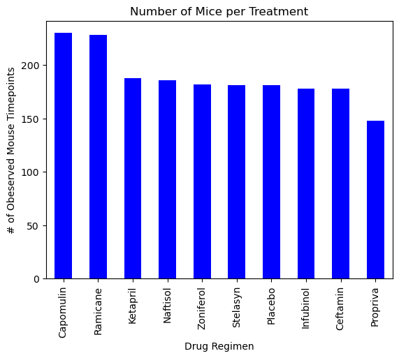
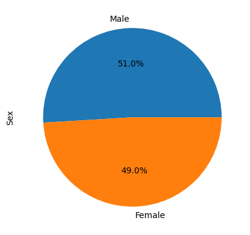
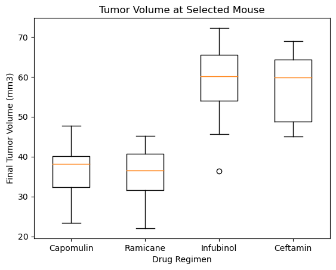
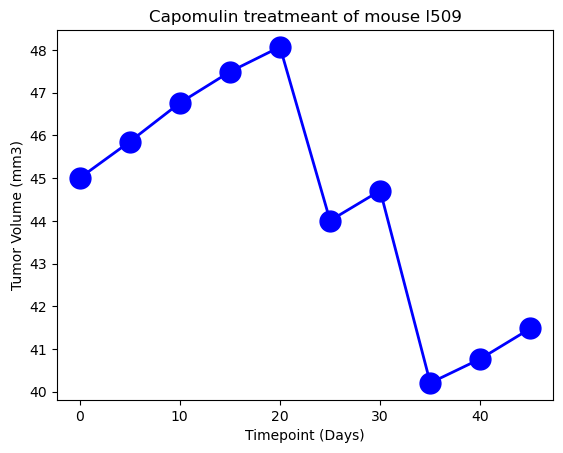
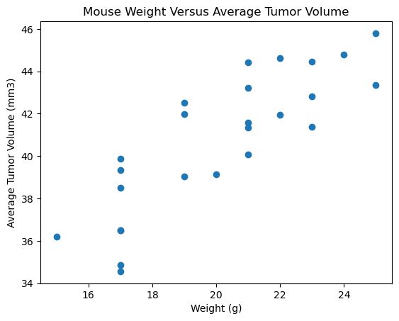
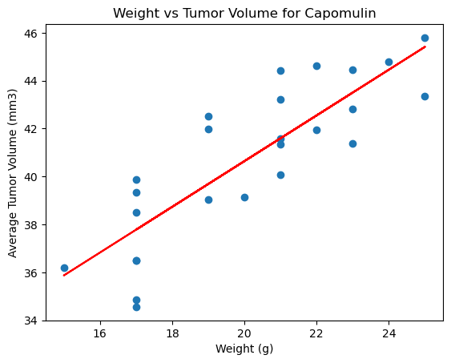

# Pymaceuticals Inc.

## Purpose

The purpose of this study was to compare the performance of Pymaceuticals drug of interest, Capomulin, against the other treatment regimens.

## Tasks

- Check the data for any mouse ID duplicate and remove any data associated with that mouse ID.
- Clean the data for an accurate analysis.
- Summarize statistics table consisting of the mean, median, variance, standard deviation, and SEM of the tuimor volume for each drug regimen.

  

- Generate a bar plot using Pandas and Matplotlib to show the number total data points for each treatment regimen.

 

- Generate a pie plot using Pandas and Matplotlib to show the distribution of female or male mice in the study.

 

- Calculate the final tumor volume of each mouse across four of the most promising treatment regimens: Capomulin, Ramicane, Infubinol, and Ceftamin. Calculate the quartiles and IQR and quantitatively determine if there are any potential outliers across all four treatment regimens.
- Using Matplotlib, generate a box and whisker plot of the final tumor volume for all four treatment regimens and highlight any potential outliers in the plot by changing their color and style.

- Select a mouse that was treated with Capomulin and generate a line plot Timepoint vs Tumor Volume.

- Generate a scatter plot of mouse weight vs average tumor volume using the Capomulin tratment regimen.

- Calculate the correlation coefficient and linear regression model between mouse weight and average tumor volume for the Capomulin treatment.
- Plot the linear regression model on top of the precious scatter plot.
- The correlation between mouse weight and the average tumor volume is 0.84.

  
